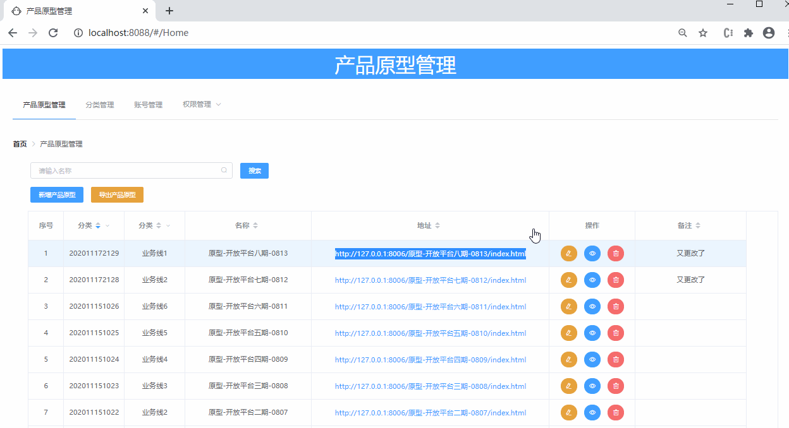
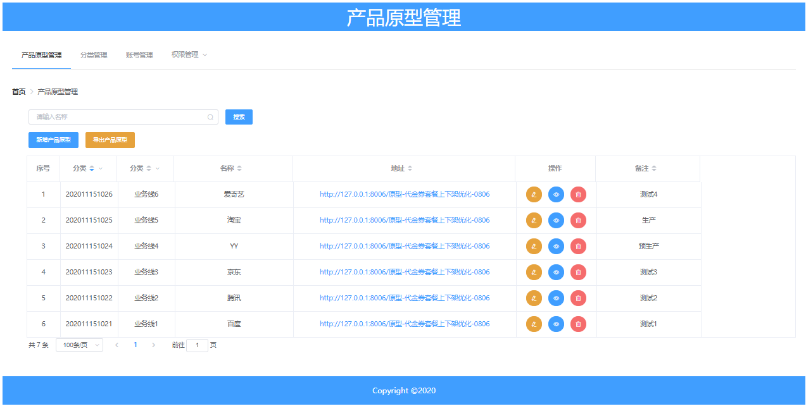
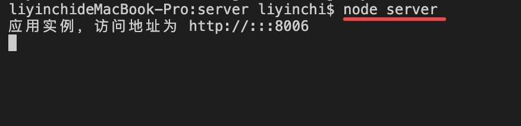
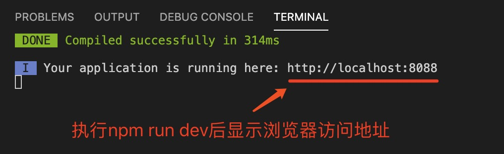
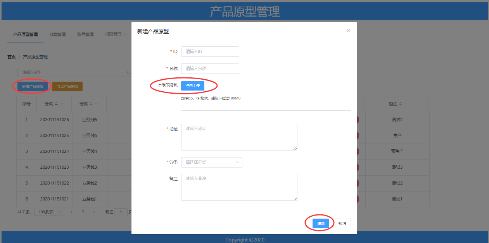
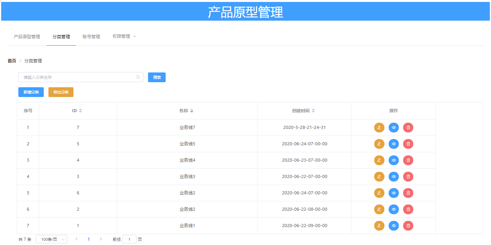
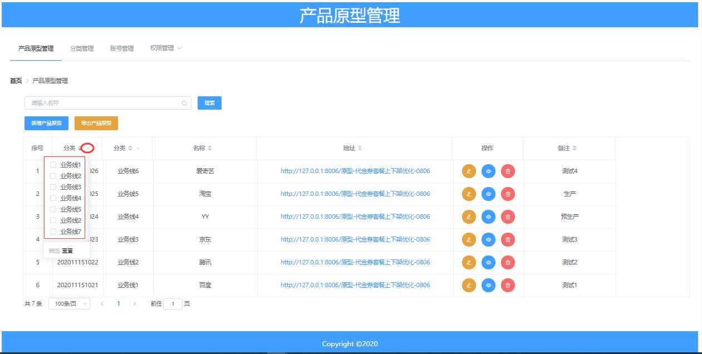
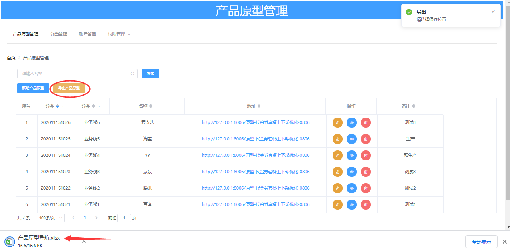

# PrototypeManager

[](https://www.npmjs.com/package/vue-lowdb) [](https://vuejs.org/)

> 产品原型压缩包管理



recommend: [China-Gitee](https://gitee.com/liyinchi/PrototypeManager)，[Other-Github](https://github.com/Musule/PrototypeManager)

## 功能

* 新建分类
* 删除分类
* 编辑分类
* 查询分类
* 新建原型版本
* 删除原型版本
* 编辑原型版本
* 查询原型版本
* 新建管理员账号、菜单权限
* 编辑管理员账号、菜单权限
* 导出数据


### 【管理员】


### 【访客】


## 开发环境

|名称|版本|
|-|-|
|nodejs| v12.13.0|
|vue|v2.5.2|


## 安装
1.下载Nodejs

>https://npm.taobao.org/mirrors/node/v0.12.13/

（建议版本使用v12.13.0 小于v15.0）


2.安装Nodejs

（1）检查版本
```bash
node -v
```
（2）设置淘宝镜像（提升安装速度）
```bash
npm config set registry http://registry.npm.taobao.org/
```

>如果你已安装Nodejs环境，可跳过1和2步骤

3.安装与使用

* 克隆工程

```bash
git clone git@github.com:Musule/PrototypeManager.git
```

（1）启动服务端

① 打开cmd终端窗口，进入目录/PrototypeManager/server下（window 不要用 powser shell）

```bash
cd /PrototypeManager/server
```
② 执行安装命令

* 安装cnpm
```
npm install -g cnpm --registry=https://registry.npm.taobao.org
```
* 安装所有依赖库

```bash
cnpm install
```

③启动后端服务

```bash
node server
```



（2）启动前端

①再次打开新的cmd终端窗口，进入目录/PrototypeManager下，执行命令行如下命令：

```bash
cd /PrototypeManager
```

②安装

* 安装node-sass
```bash
cnpm install node-sass --save
```

* 安装所有依赖库

```bash
cnpm install
```

③启动前端

```bash
npm run dev
```



（3）浏览器地址访问
>http://localhost:8088


你也可以直接访问工程底下根目录dist文件夹，打开index.html


# 操作手册

## 登录管理员

账号：admin
密码：123456


>访客无需登录，仅有查看权限

修改每个账号的密码，可以通过PrototypeManager\server\public\User.json


## 新增原型版本




## 新建分类




## 筛选分类



## 新建账号


## 导出数据



## 注意事项

* 1.产品原型压缩包，暂不支持文件夹嵌套压缩。

例如： 压缩包.zip 解压后根目录就是原型文件内容，而不是还有一层文件夹进去才是原型文件内容。

* 2.压缩包名称和解压后文件夹名称要一致。

## TODO 开发中

* 1.支持rar、tar
* 2.多层级解压


